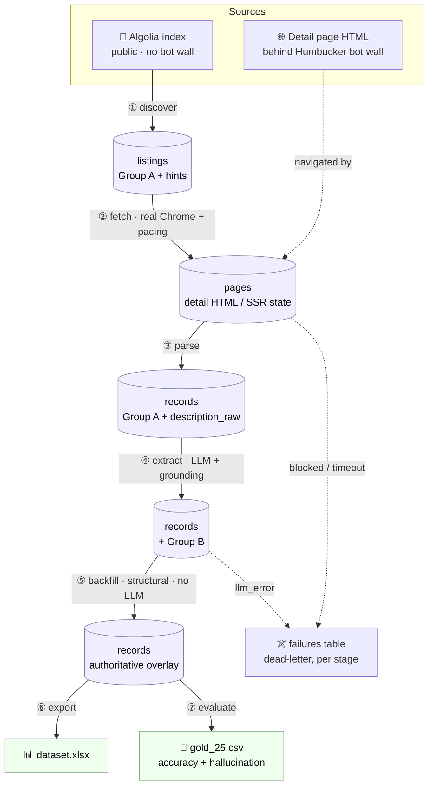
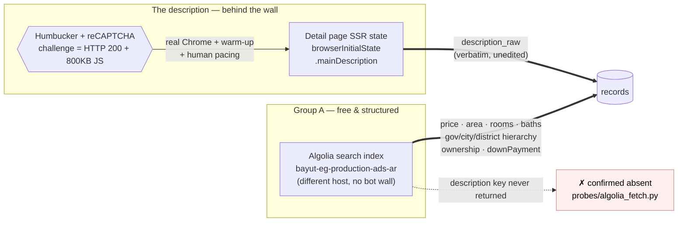
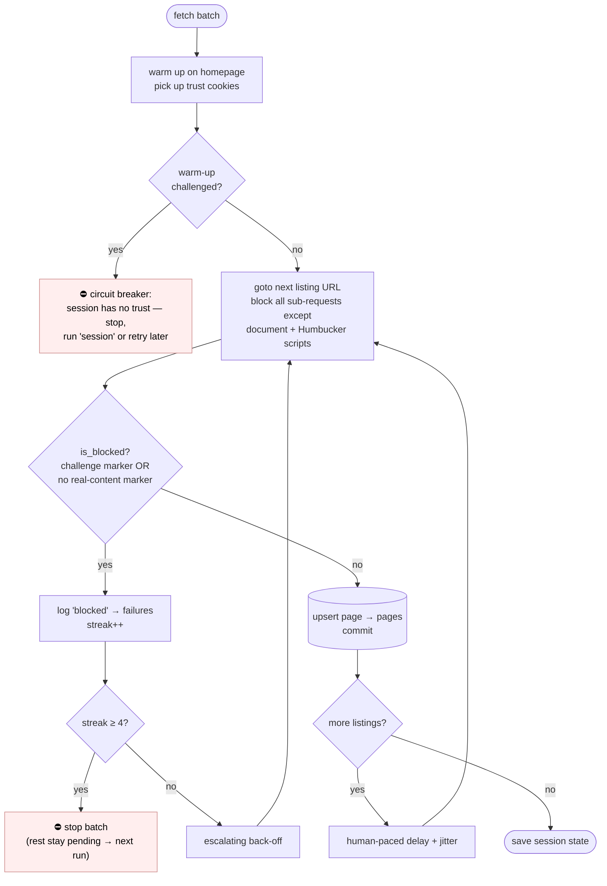
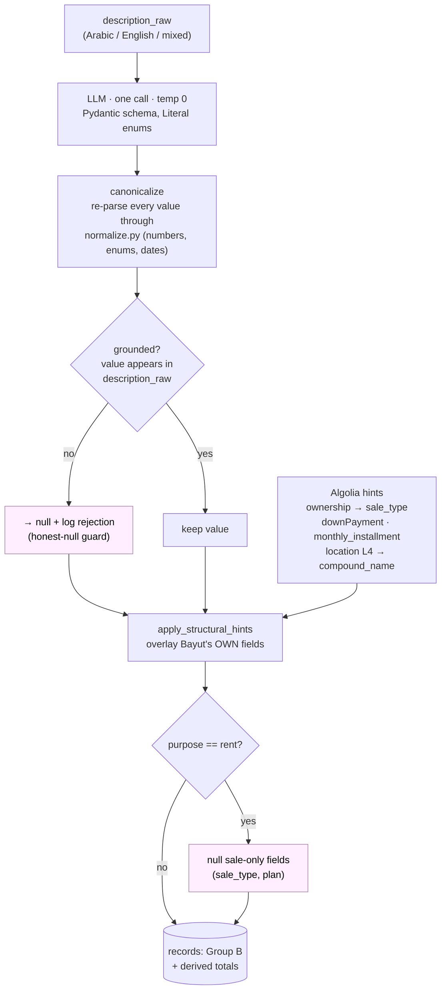

# Egyptian Housing Market Dataset — Bayut Egypt

Turn Bayut Egypt listings into a **research-grade dataset**: the structured
fields the site already has (Group A), plus the fields that only exist inside
the free-text Arabic/English description (Group B) — compound, finishing
level, delivery date, the full payment plan, amenities, and more — extracted
so a researcher can trust them.

The goal, in the brief's own words, is to let an economist answer *"what is the
median price per m² for a 3-bed apartment in New Cairo, and how does the cash
price compare to the total cost under a 7-year installment plan?"* — **without
opening a single listing.** This repo produces that dataset and measures how
much of it you can trust.

---

## Results at a glance

| | |
|---|---|
| **Listings in dataset** | **521** (517 with a full Group B extraction) |
| **Purpose** | 306 sale · 215 rent |
| **Governorates** | Cairo 235 · Alexandria 144 · Giza 142 |
| **Property types** | apartment 458 · villa 63 |
| **Extraction cost (final run)** | **$0.00** — Google Gemini free tier |
| **Hallucination rate (gold, 25 listings)** | **~0%** on every field |
| **Group B accuracy** | 90–100% on the high-value structured fields (location, compound, finishing, sale_type, full payment plan); see [Evaluation](#evaluation) |

The dataset is committed at [`data/out/dataset.xlsx`](data/out/dataset.xlsx) so
you can inspect it without running anything.

---

## Architecture at a glance

Seven stages, each reading its input from SQLite and writing its output back —
nothing passes between stages in memory. That single rule is what makes the
whole thing idempotent and resumable.



Everything lives in one file, [`data/bayut.db`](data/bayut.db) (WAL mode, so you
can query it from another terminal mid-run). Re-running any stage re-issues its
"what's pending" query, which naturally shrinks to zero — so a second run does
nothing, and an interrupted run resumes exactly where it stopped.

---

## Quickstart (from a clean clone)

```bash
pip install -r requirements.txt
playwright install chromium        # for the one-time manual `session` bootstrap only;
                                   # the bulk fetch uses your REAL installed Chrome
cp .env.example .env               # add GOOGLE_API_KEY=... (free, no card — aistudio.google.com/apikey)

python cli.py discover             # Algolia sweep → listing pool  (fast, no bot wall)
python cli.py session              # ONE TIME: opens real Chrome; clear any challenge by hand, press Enter
python cli.py fetch --limit 500    # detail-page HTML → SSR state  (resumable, bot-gated)
python cli.py parse                # Group A + description_raw from fetched pages
python cli.py extract              # Group B via LLM (needs GOOGLE_API_KEY)
python cli.py backfill             # re-apply Bayut's own structured fields (no LLM)
python cli.py evaluate             # score against data/gold/gold_25.csv
python cli.py export               # → data/out/dataset.xlsx

python cli.py status               # progress at every stage
python cli.py failures             # dead-letter log, grouped
# python cli.py run --limit 500    # fetch → parse → extract → backfill → export in one go
```

Every command is safe to re-run: each stage only processes what is still
pending (see [`src/db.py`](src/db.py)), so stopping at listing 300 and running
again picks up at 301 — no duplicates, no re-fetching. See
[Robustness](#robustness-idempotent-resumable-auditable).

---

## How the data comes out

Two very different sources, because Bayut splits the data across two systems
with two completely different access profiles.



### 1. Group A → Bayut's public Algolia index (no bot wall)

Discovery was never the hard part. Bayut's site search is powered by a
**public, unauthenticated Algolia index** (`bayut-eg-production-ads-ar`, app
`LL8IZ711CS`) that carries **no bot detection at all** — it lives on a
different host from the website. [`src/discover.py`](src/discover.py) issues one
HTTP POST per page of results, sliced by **purpose × governorate × category**
so the pool is stratified across sale/rent and across all three governorates by
construction, instead of whatever the default ranking floats to the top.

Each Algolia hit hands back **almost every Group A field already structured and
already bilingual**: `price`, `rooms`, `baths`, `area`, `purpose`, `agency`,
`createdAt`, verification flag, and — the part a naïve scraper would rebuild by
hand — a fully **normalized governorate/city/district hierarchy** (`location[]`
with `name` / `name_l1` at each level). No gazetteer, no fuzzy geocoding. It
even carries a few Group-B-*shaped* structured fields Bayut tracks internally
(`extraFields.ownership`, `downPayment`, `monthly_installment`,
`completionStatus`) — used as authoritative back-fills, documented under
[Extraction](#extraction-rules-first-llm-second).

There is exactly **one deliberate gap: `description` is not in the Algolia
payload.** Confirmed empirically, not assumed — [`probes/algolia_fetch.py`](probes/algolia_fetch.py)
requests every attribute (`attributesToRetrieve: ["*"]`) plus `description`
explicitly across sibling indexes; the key never comes back. Evidence in
[`data/network/VERDICT.md`](data/network/VERDICT.md).

### 2. The description → the detail page's SSR state (behind the bot wall)

The description — where all of Group B lives — only exists on the rendered
detail page, and **every HTML page on `bayut.eg` sits behind Humbucker**, an
in-house bot wall (with reCAPTCHA Enterprise underneath; both are named in the
site's own client config). So the fetch stage
([`src/fetch.py`](src/fetch.py)) is the whole fight. What I tried, each step
ruling out one hypothesis:

| Attempt | Result |
|---|---|
| `httpx` with a browser UA | challenged |
| `curl_cffi` impersonating Chrome's TLS fingerprint, no cookies | challenged |
| `curl_cffi` **+ a valid prior session's cookies** | **still challenged** — cookies alone never clear it; the check demands live JS execution every time |
| Playwright + **bundled Chromium** + `playwright-stealth` | client-side reload loop; `page.content()` throws mid-navigation — the bundled binary is itself the fingerprint |
| Playwright + **real installed Chrome** (`channel="chrome"`) + stealth + a homepage **warm-up** before the first deep link | ✅ clean fetch, full page, first try |
| The working recipe repeated fast from one IP | degrades back to challenged — velocity/IP-reputation scored |

**The working recipe** (in `fetch.py`): real Chrome, one continuous browser
session for the whole batch, a homepage warm-up to pick up trust cookies,
aggressive **route-blocking** (allow only the document + Humbucker's own
challenge scripts, abort the other ~300 sub-requests per page — fewer requests
is also a lower challenge surface), **human-paced delays with jitter**, and a
**circuit breaker** that stops the whole run the moment even a warm-up
navigation is challenged rather than burning the queue into the dead-letter log
one row at a time.

The fetch loop, including the two safety mechanisms that keep a bot-gated run
from either lying about success or hammering the detector:



Two details that matter:

- **The description is read out of the SSR state, not scraped from the DOM.**
  Once a page loads, its `<script id="browserInitialState">` blob contains
  `property.data.mainDescription` — the **verbatim** listing text with its
  `<br/>` markup intact, exactly the "full original text, unedited" the brief
  asks for. `parse.py` prefers this over the tag-stripped JSON-LD copy and over
  the DOM span. It **never anchors on CSS class names** (`._4dbf61ca`-style,
  content-hashed, rotate every deploy) — only on stable JSON keys and the
  `aria-label="وصف العقار"` fallback.
- **The bot challenge returns HTTP 200** with a ~750–830 KB body of obfuscated
  JS, so `response.ok` and a size check both *look* like success on a page with
  zero listing data. `fetch.is_blocked()` therefore checks for the literal
  challenge markers **and** requires a positive content marker
  (`browserInitialState` or `"@type":"RealEstateListing"`) before trusting a
  fetch — so a block becomes a logged `failures` row, never a silently-empty
  success.

The whole discovery vs. fetch split is why the pipeline is cheap where it can be
(Group A from a free JSON API) and careful where it must be (one paced,
resumable, circuit-broken browser run for the descriptions).

---

## Extraction: rules first, LLM second

Group A needs no LLM — it is already structured in the Algolia hit. Group B is a
**hybrid**, because the two halves of the problem have different right tools:



The three principles the diagram encodes: **the model supplies the field, regex
supplies the number; nothing survives that isn't in the text; and where Bayut
states a fact itself, that authoritative value wins.**


- **Deterministic → [`src/normalize.py`](src/normalize.py)** (pure functions, unit-testable).
  Arabic-Indic digit conversion, `"1,500,000"` / `"1.5M"` / `مليون ونصف` all
  collapsing to the same `1500000.0`, percentage parsing, year/quarter
  extraction, and enum canonicalization so `"super lux finishing"` and
  `تشطيب سوبر لوكس` become the same value. Regex genuinely wins here — there's
  no ambiguity in what `"1.5M"` means once you've found it.
- **Semantic → [`src/extract.py`](src/extract.py)** (one LLM call per listing,
  `temperature=0`, a Pydantic schema with closed-`Literal` enums). The model
  decides *which* sentence is the down payment vs. the installment vs. the price
  restated; whether a finishing phrase describes *this* unit; whether a name is
  a compound or just a district. It supplies the field; `normalize.py` supplies
  the number — every value it returns is re-parsed through the deterministic
  layer before it is trusted.
- **Grounding check.** Every non-null value the model returns must actually
  appear in `description_raw` (digit- and script-normalized). Anything that
  doesn't is nulled and logged as a grounding rejection. This is deliberately
  strict — it would rather null a correct-but-inferred value than trust the
  model's outside knowledge over the text, which is exactly what the brief's
  honest-null rule demands.
- **Structural back-fill ([`src/backfill.py`](src/backfill.py) +
  `extract.apply_structural_hints`).** A few Group-B facts *are* published by
  Bayut as structured fields (`extraFields.ownership → sale_type`,
  `downPayment`, `monthly_installment`/`installments_payment_duration_years →`
  the payment plan, `location[]` level 4 `→ compound_name`). These are
  authoritative, so they **overlay** the LLM's read of the prose where Bayut
  states the fact itself — and, crucially, `backfill` re-applies them to
  already-extracted rows **with no LLM call**, so improving this layer never
  re-spends the extraction budget. A `purpose=='rent'` guard nulls sale-only
  fields (`sale_type`, installment plan) on rentals, since those are category
  errors on a lease.

**Where it fails (honest):** grounding is a substring check, not semantic
verification — a number that's present but attached to the wrong field would
still pass. Enum glossaries are hand-built from ~30 listings' worth of reading,
so an unseen phrasing falls through to `null` (the safe direction). A closed-enum
guard (`canon_enum`) then drops any value that's neither a glossary match nor a
schema-valid literal — so off-enum LLM output like `finishing_level="ultra lux"`
or `installment_frequency="متساوية"` becomes `null` rather than leaking into the
dataset (while valid literals the glossary happens to miss, e.g. `payment_type
="both"`, are preserved). `delivery_status` and `floor_number` are the weakest
gold fields (67% / 77%) — genuine free-text recall gaps, not normalization bugs.

---

## What each file does

```
cli.py                 One entrypoint, one subcommand per stage. Nothing but argparse + dispatch.
pick_gold.py           Randomly (seeded) selects 25 listing_ids into the gold CSV for hand-labeling.
requirements.txt       Pinned deps.
.env.example           GOOGLE_API_KEY (free path) / OPENROUTER_API_KEY (paid alt).

src/
  config.py            All paths, versions, model/provider selection, Algolia constants, fetch pacing.
                       Provider auto-selects: GOOGLE_API_KEY → free Gemini, else OpenRouter.
  db.py                SQLite: schema, the single upsert() write path, the pending_*() resume
                       queries, and lightweight migrations. ALL pipeline state lives here.
  discover.py          Stage 1. Algolia sweep → `listings` table (Group A, stratified).
  fetch.py             Stage 2. Playwright + real Chrome → detail-page HTML → `pages`.
                       This is the stage that fights the bot wall.
  parse.py             Stage 3. (hit_json, HTML) → Group A fields + description_raw + hint_* columns.
  normalize.py         Pure deterministic layer: numbers, percentages, dates, enums, Arabic/English.
  schema.py            Pydantic Group B schema (Optional fields, Literal enums).
  extract.py           Stage 4. LLM Group B extraction + grounding + structural overlay.
  backfill.py          Stage 4b. Re-apply structural fields to existing rows, LLM-free.
  evaluate.py          Score records against the gold set: per-field accuracy + hallucination rate.
  export.py            Records → data/out/dataset.xlsx.

data/
  bayut.db             The one SQLite file — every stage's input and output (WAL mode).
  out/dataset.xlsx     The deliverable dataset.
  gold/gold_25.csv     25 hand-labeled listings (Group A + Group B) — the evaluation ground truth.
  network/             Evidence: the live network trace behind the "how did you get it out" story.
                       FIELD_MAP.md (where every field comes from), VERDICT.md (description is
                       absent from Algolia), requests.csv, bodies/.

probes/                Standalone investigation scripts (NOT in the run path) — the evidence for
                       the design choices: network_trace.py, algolia_fetch.py, ip_check.py.
```

---

## The five questions

**How did you get the data out, and what did you try first that didn't work?**
See [How the data comes out](#how-the-data-comes-out). Short version: Group A
from Bayut's public Algolia index (no bot wall); the description from the detail
page's SSR state, behind Humbucker. The escalation table lists what failed —
plain HTTP, TLS impersonation, cookies-without-JS, and bundled Chromium — before
real Chrome + warm-up + pacing worked.

**Why this extraction method? Where does it fail?**
Rules for the deterministic half (numbers/enums), an LLM for the semantic half
(which number is which), grounding to enforce honest-null, and Bayut's own
structured fields as authoritative back-fills. Failure modes are listed honestly
above — substring grounding, hand-built enum glossaries, weak free-text recall.

**What is your `listing_id`, and why does it survive re-runs?**
It is Bayut's own numeric `externalID` (e.g. `503972743`) — the site's primary
key, assigned once at creation, and the same number embedded in the canonical
detail URL. Not a slug (agents edit titles constantly) and not a content hash
(changes on every price edit). Every table keys on it; every write is
`upsert() … ON CONFLICT(listing_id) DO UPDATE`, so re-discovering / re-fetching /
re-parsing the same listing updates its row instead of duplicating it.

**If this ran daily for a year unattended, what breaks first?**
Fetch. (1) The bot score is opaque and tunable on Bayut's side — a threshold
change or a Chrome auto-update shifting a fingerprint would silently drop the
success rate, and `is_blocked()`'s reliance on today's markers is itself a
liability. (2) If Bayut drops the JSON-LD block or renames `aria-label="وصف
العقار"`, description extraction breaks. Both are why the circuit breaker and
the parse sanity-gate exist: a broken run should **go quiet loudly** (visible in
`status`/`failures`), not decay into a dataset that looks complete but stopped
updating months ago.

**What would you fix with another six hours?**
(1) Fetch throughput at volume — spread the fetch across many short sessions /
IPs (the resumability is built for exactly this). (2) Fuzzy compound-name
clustering so "Mountain View iCity" / "ماونتن فيو اي سيتي" / "MV iCity" collapse
to one entity (`rapidfuzz` is already a dep). (3) A cheap second-model verifier
on grounding-rejected rows, to separate "hallucinated" from "present but phrased
so the substring check misses it". (4) Widen the enum glossaries so off-enum
values are *mapped/recovered* (e.g. `ultra lux → super lux`) instead of nulled —
the guard already prevents them from leaking, but recovering the value beats
dropping it.

---

## Robustness (idempotent, resumable, auditable)

- **No re-fetching, no duplicates.** Each stage's input is a `pending_*()` query
  (`LEFT JOIN … WHERE … IS NULL`) that shrinks to zero as rows fill in; every
  write is `upsert()` on a primary key. Re-running a finished stage prints
  `nothing pending` and does nothing.
- **Resumable.** State lives entirely in `data/bayut.db`, committed per listing.
  Stop at 300 (crash, `Ctrl-C`, or the circuit breaker) and the next run resumes
  at 301. Blocked/timeout fetches are always retried; only non-transient hard
  errors are dropped after 3 attempts.
- **Failures logged, not swallowed.** Every stage writes dead-letter rows to a
  `failures` table (`python cli.py failures`), and the LLM cache
  (`extractions`, keyed on `listing_id + prompt_version + model`) means a
  re-run never re-spends on a row already done.

---

## Evaluation

25 listings hand-labeled in [`data/gold/gold_25.csv`](data/gold/gold_25.csv) by
opening each one and reading it. `python cli.py evaluate` scores `records`
against them. **Accuracy** is over rows where the gold is non-null (numeric
within 5%, enums exact after canonicalization, amenities Jaccard ≥ 0.5).
**Hallucination rate** is how often the pipeline produced a value where the
truth was null — the number the brief cares about most.

| field | gold non-null | pred non-null | accuracy | hallucination |
|---|---|---|---|---|
| compound_name | 16 | 15 | 94% | 0% |
| developer_name | 6 | 5 | 83% | 0% |
| governorate | 25 | 25 | 100% | — |
| city | 25 | 25 | 96% | — |
| district | 18 | 18 | 94% | 0% |
| finishing_level | 11 | 11 | 91% | 0% |
| delivery_status | 15 | 11 | 67% | 0% |
| delivery_date | 2 | 0 | 0%\* | 0% |
| sale_type | 14 | 14 | 100% | 0% |
| payment_type | 6 | 6 | 83% | 0% |
| down_payment_amount | 5 | 5 | 100% | 0% |
| down_payment_pct | 5 | 5 | 100% | 0% |
| installment_years | 6 | 6 | 100% | 0% |
| installment_amount | 3 | 3 | 100% | 0% |
| installment_frequency | 3 | 3 | 100% | 0% |
| cash_discount_pct | 3 | 1 | 33% | 0% |
| amenities | 23 | 22 | 74% | 50%† |
| floor_number | 13 | 10 | 77% | 0% |
| is_negotiable | 1 | 2 | 0%\* | 4% |

**Reading it honestly.** Hallucination is ~0% across the board — the honest-null
discipline holds, and that is the headline. The high-value structured fields
(location, compound, finishing, `sale_type`, and the **entire payment plan**)
sit at 90–100%. The low cells are tiny samples (`delivery_date` n=2,
`cash_discount_pct` n=3, `is_negotiable` n=1 — one row swings them 30–50 pts) or
genuine free-text recall gaps (`delivery_status`, `floor_number`).
\* both `delivery_date` gold labels are *durations* ("3 years", "3 months"), but
the field is defined as an absolute year/quarter, so a null is arguably correct.
† 50% of just **2** gold-null amenity rows = one row.

---

## Failure log

The real obstacles to getting the data out — the bot wall, the cookies-without-JS
dead end, the bundled-Chromium reload loop, IP-velocity scoring, the HTTP-200
challenge trap, dynamic JS injection, content-hashed CSS, and free-tier LLM rate
limits — each with the concrete signal that revealed it and the fix that beat it,
are written up in detail in **[`FAILURE_LOG.md`](FAILURE_LOG.md)**.

Summary of the run's logged failures (`python cli.py failures`):

| Stage | `error_class` | Count | Handled by |
|---|---|---|---|
| fetch | `blocked` | 13 | `is_blocked()` content marker + circuit breaker; stay pending, retried |
| fetch | `exception` | 22 | nav timeouts, logged not swallowed; retried next run |
| extract | `llm_error` | 190 | free-tier rate-limit/empty-response; recovered by retry + pacing |

**No failure lost data**: every blocked fetch stays in the pending queue, every
failed extraction is a re-runnable `extractions` row. Final dataset: 521 listings,
517 fully extracted.

---

## Cost / compute

The **final** 517-listing extraction ran on **Google AI Studio's free Gemini
tier → $0.00** (no credit card; I'm in Egypt without a working international
card, which also drove the provider choice). The pipeline still tracks real
usage in the `extractions` table (`SELECT SUM(...)`, not an estimate): across
all of development — including trial runs on paid models (Claude Haiku, Gemini
2.5 Flash) before switching to the free tier — the estimator totals **~$0.18**
and ~1.1M tokens. Provider is swappable via `.env`; set `OPENROUTER_API_KEY`
instead of `GOOGLE_API_KEY` to route through OpenRouter.

---

## Deliverables map

| Deliverable | Location |
|---|---|
| Dataset (XLSX) | [`data/out/dataset.xlsx`](data/out/dataset.xlsx) |
| Failure log | **[`FAILURE_LOG.md`](FAILURE_LOG.md)** (detailed) + `python cli.py failures` |
| Evaluation (gold + numbers) | [above](#evaluation) + [`data/gold/gold_25.csv`](data/gold/gold_25.csv) |
| One-page analysis | [`report.md`](report.md) |
| Walkthrough / methodology | this README |
| Field-provenance evidence | [`data/network/FIELD_MAP.md`](data/network/FIELD_MAP.md), [`data/network/VERDICT.md`](data/network/VERDICT.md) |
